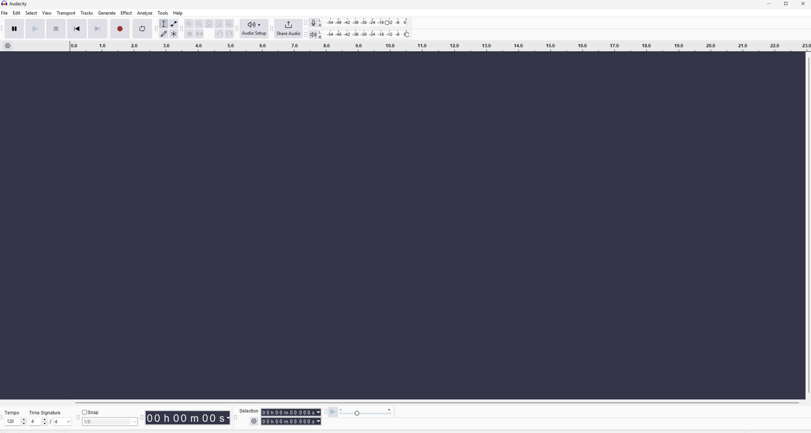
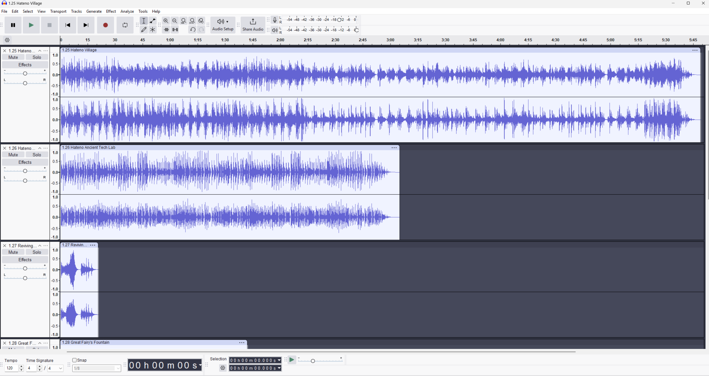
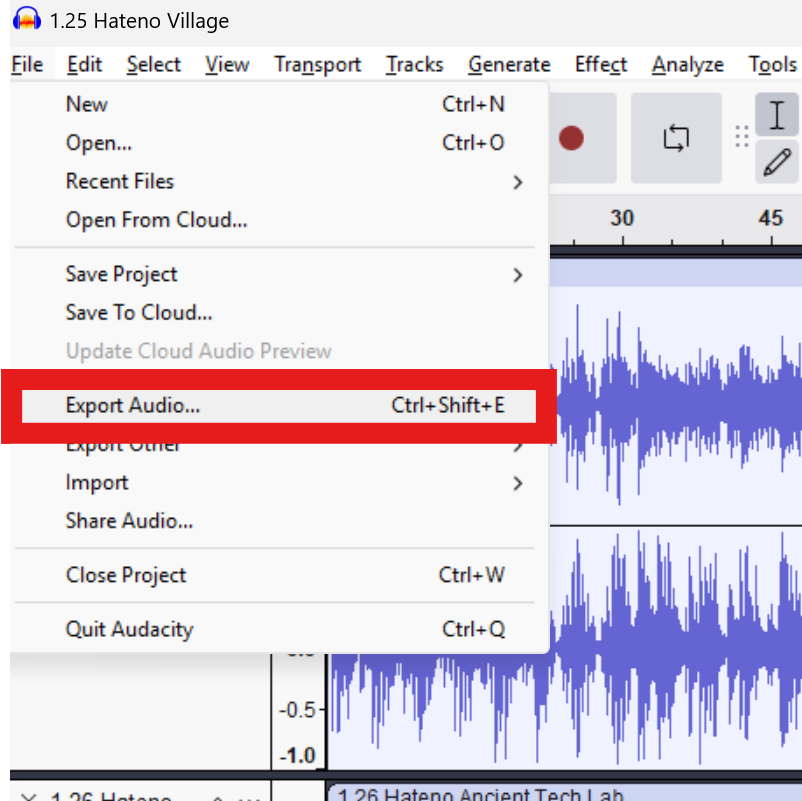

# Converting Audio Files (Made Easy!)

!!! info

    As of True Adaptive Music version 1.2 you no longer need to convert audio files to .ogg, but you will need to [setup ffmpeg](../FFmpeg%20Support.md) for playback to work.

## Converting with Audacity (the easy way)

Since converter websites are sketchy beyond hell as there is nothing stopping them from stuffing any data they want within a file you get there, we'll discuss a much better alternative. Enter the wonderful DAW app Audacity, which you can download [here](https://www.audacityteam.org). Once you have gone through the installation, start it up.

There are many ways to batch convert files with Audacity, one of the most cumbersome ways I consistently saw online involved macros (it ain't that deep).
With Audacity open, you'll be met with this window:

From here, you can simply drag and drop all your files right into the audacity window, and you'll see every file laid out in its own track:

Now it's just a matter of batch exporting these files as .mp3, which you can do by going to File -> Export Audio.

This will open the export window. From here you will want to make sure you have the "Multiple Files" option selected, and also hit the "Browse..." button if you want to save the files to a more convenient place than it already shows.

Then hit "Export" and you should see each file get converted in order. Once that is done, go to the destination that was selected and pick up your fresh .mp3 files. You're now ready to move on to placing those files in the right place!