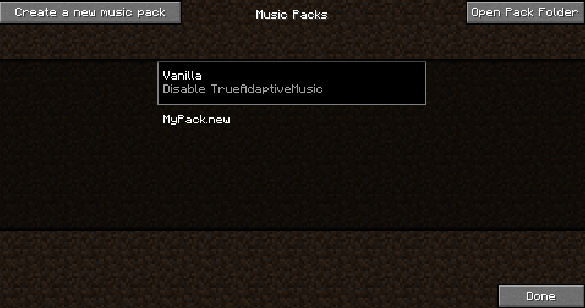
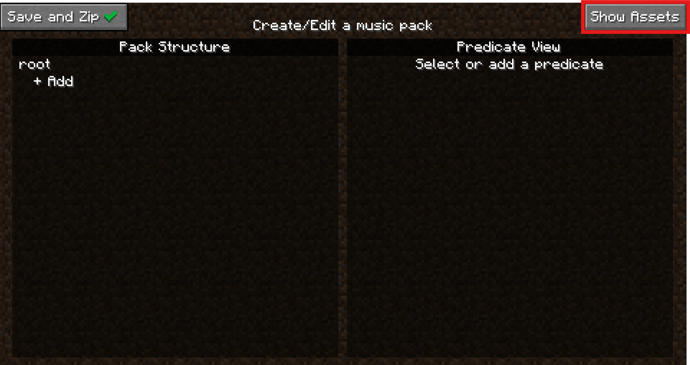
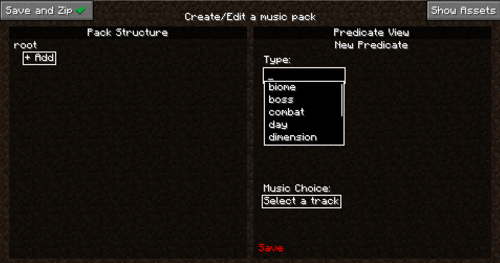
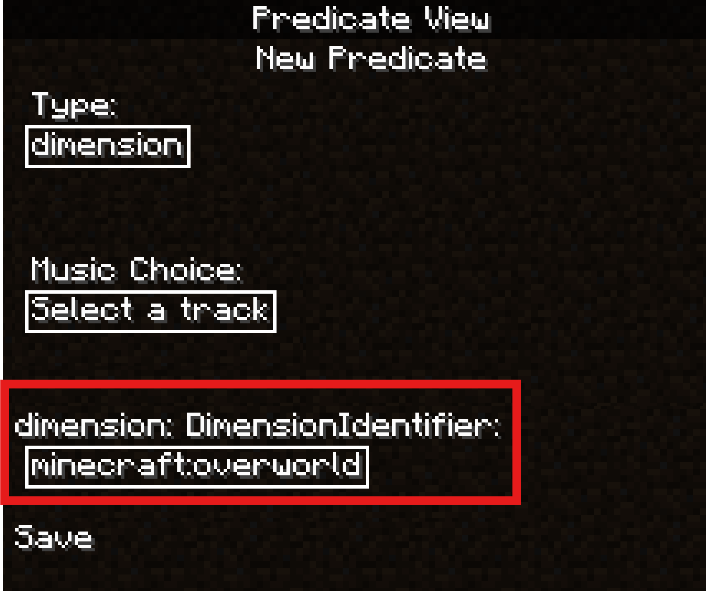
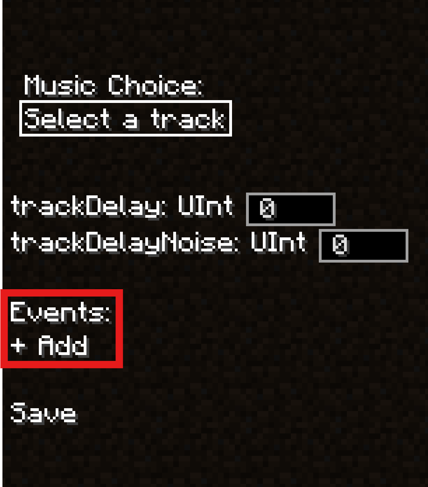

# For Creators

## Quick Start: For Music Pack Creators

!!! warning

    Music Pack Creating/Editing is only available for Minecraft versions 1.20+. Any Music Pack made in any version will still be compatible with other versions of Minecraft.

### Creating new a Music Pack

So you want to create a Music Pack? First of all, thank you! If you have any creations you are proud of by the end of this I encourage you to share in the [community discord](https://discord.gg/v64K4hNdXu)! Now, let's get started.

Start by clicking the "Create a new music pack" Button at the top left. This will bring up the MusicPack naming screen. Type in a name and hit "Accept" to continue, which will open the pack editing screen:

#### Saving Without Exporting to Zip
Before we do anything, a quick note on saving. When you opened this editing page, a folder was immediately created called {yourpackname}.new in the trueadaptivemusicpacks folder. From now on, every single action you take will be saved real-time inside this folder, provided you hit the small save button in the right "Predicate View" panel. This way you don't need to worry about leaving this menu or game crashes. This also offers a great way to incrementally test your pack since you don't need to "Save and Zip" your pack to use it. It will still show up in the main page. Don't believe me? Hit escape to return to the previous page now.

Your new pack should be sitting there all fancy, and it will auto reload as you exit the pack screen for testing. If you are curious what an empty pack looks like, you can hit the "Open Pack Folder" button to take a look. Otherwise click on your pack if you haven't already, and you will see a "Edit Pack" button show up at the bottom left. Click that to return to the editing screen.

This silence is deafening isn't it, let's go ahead and get some tunes playing. Click on the text labeled "root" at the top left.

Then click the "Select a track" button on the right. To open a dropdown of all available music. If you don't have any mods that add music (and you didn't skip ahead and add your own assets), you should just see a list of all the vanilla Minecraft music expressed as Sound Events. Go ahead and pick one, then hit the "Save" button just under it, we'll be here a while.

Phew! The silence was really getting to me, thanks for that. Now that we have some easy listening, we can talk about the edit screen.

As you can see, the edit screen is seperated into two panels, let's talk about the left first, the Pack Structure panel.

### Pack Structure Panel

The pack structure defines the structural logic of your music pack, specifically when certain music should play. Every music pack has a tree-like structure, with the top level only holding the "root" node in that tree. Every node in this tree represents a predicate. A predicate is just a condition in which certain music can be played, and can be one of many different types. For a list of all types, you can visit the [Predicate Types](MusicPacks/Predicate%20Types.md) page. Every node in the tree has a depth, denoted by how indented the node is on screen, and the "child" node of another node will have 1 more than the depth of its parent. Also within each node is a list of songs to play when that node is chosen (this is what we chose when setting music on the root node). For an explanation of how predicate nodes are chosen each tick of the game, go [here](../Music%20Packs/Predicates.md#How-is-a-Predicate-Node-Chosen).

### Adding Assets

Now that we know the basics, we can start thinking about how we want to theme the pack. If you want to just try out making a basic pack with vanilla sound events only you can skip down to [Creating the Pack (Finally)](#creating-the-pack-finally). If you are making a pack right now (if you aren't why are you here), you might already have some ideas for how you want to theme your pack. If you do, now would be a good time to gather some assets (external audio files) for your pack. Now I do work for the FBI, CIA, NATO, specifically the Chicago police that patrol O-Block and the Illuminati, so I won't tell you that there are many great ways to get good music from other games to use for your music pack. And I definitely won't tell you that the Internet Archive is a great way to find some. By default Minecraft only supports .ogg files, but lucky you! As of True Adaptive Music 1.2 basically any audio file type is supported, as long as you [setup ffmpeg](../FFmpeg%20Support.md) first. If you (for some reason) want to stick with .ogg, then you can follow [this guide](../Other%20Stuff/Converting%20Audio%20Files.md) for converting any files to .ogg easily. Once you have some files ready, continue on.

#### Where to Place Your Assets

This part is easy as pie, just hit the "Open Assets" folder in the edit screen and drag your files into the folder that opens. If that somehow doesn't work, you can just head to the folder yourself, which is in the same directory as the resourcepacks folder in your Minecraft root installation. Find {your_music_pack_name}.new, open it, and drag your files into the `assets/` folder.

### Creating the Pack (Finally)

Now let's get into actually modifying the structural logic of the pack. You can add a child to any node just by clicking the "+ Add" button under it, which you can do to the button under "root" right now. Once you do, you'll see that the Predicate View panel on the right updated to allow you to create the node. Note that changes made here are not in-effect until the save button at the bottom of the right panel is clicked. Be aware can't create certain predicates from here if you opened this page without being loaded into a world, since some parameters for certain predicate types rely on accessing a dynamic registry, which is empty when not loaded into a world. Pick any that don't have this restriction such as day/night/title_screen. Now you can simply pick a song, or some songs, to play from the "Music Choice" dropdown. If you select a song but want to remove it, just click on it in the list under the dropdown. Once you're done, you can hit "Save" under the Music Choice, and this will commit the change to the actual music pack folder. If you change your mind about any property of a node, you can just click on it and modify any of the same settings (just make sure to hit "Save" again after). You can even go into a world to test this now as long as your ".new" pack is selected from the pack selection screen. As you'll see in this next section, you'll want to join a world in a second anyway ;)

### Other Required Predicate Parameters

With simple predicate types like title_screen, day, or night, the predicate itself is binary (it's either day or it isn't). For other predicate types though, it isn't so simple. Let's examine the dimension predicate for example. First make sure you are loaded into a world, lest you fall victim to the aformentioned red save button. Once you are loaded in, make your way back to the predicate menu and press the "+ Add" button on any node, or click any existing node (other than root) to modify it. Set the predicate type to dimension and you'll see a new "dimension" parameter.

This is another dropdown that allows you to select an identifier for the dimension you want for the predicate. Here you can select any dimension you want, and then select music that can play in that dimension. As said before, you could create child nodes of this dimension node as well to have specific music for day/night/combat/etc.

### Optional Predicate Node Parameters

As of True Adaptive Music version 1.2, there are some some extra parameters tied to each node in the "Predicate View" panel. These are optional and explained [here](../Music%20Packs/Optional%20Node%20Parameters.md).

### Moving Predicate Nodes

As of True Adaptive Music verison 1.2, you now move predicate nodes by simply clicking and dragging from the selected node. An arrow will show exactly where your node will go when you release the button. You can't move any nodes above root and you also can't move a node to be a child of itself.

### Events

As of True Adaptive Music version 1.2, there is support for "events" as well. There is more information on them [here](../Music%20Packs/Events.md), but consider them like one-shot music triggers rather than a continuous condition in which music plays. To add an event, select any predicate and click the "+ Add" button. If there is an existing event there

Now the Predicate View Panel moves to the left side and the new Event View Panel appears. Here you can customize the event the same way you do with predicates. The music you pick here will be played specifically when the event occurs, assuming the node or it's children are selected.

Once you are done creating/editing the event, you can either hit the "Save" button in the panel or hit "Back" at the top of the panel to discard your changes to the event. Make sure to finally hit "Save" in the Predicate View Panel to save your event changes to the pack.

### Exporting the Pack

That's really all there is to it. You can head to [Other Functionalities](#other-functionalities) for any other features in the editor, but you now know everything you need to make a Music Pack... except... well exporting. Luckily this is super simple, just hit the "Save and Zip" button at the top left:

This will delete your ".new" directory and replace it with a zipped up version in the same pack directory so you can send it around easily. Zip files can also be loaded the same way as directories, so you don't need to unzip it to use it. If you decide you want to edit your pack again, just select your ".zip" pack in the pack selection screen and select "Edit Pack" again. This will create another ".new" directory pack and keep your ".zip" as a backup. Selecting "Save and Zip" on the ".new" pack will overwrite your existing ".zip" pack.

### Outro

Congrats on making it through this "quick" start. Once again, please let us know if there is anything you want to see improved with this wiki! You can now head to the MusicPacks section at the top left of this wiki for more info on the inner workings of MusicPacks! If you want to take a look at some more advanced capabilities for Music Pack creation such as adding custom predicate and event types, also take a look at the [advanced topics](../Advanced%20Topics/Advanced%20Topics.md) section.
