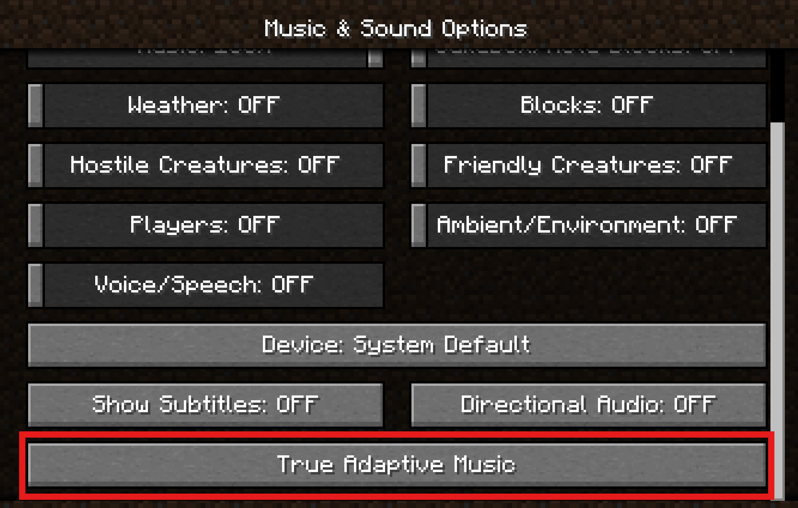
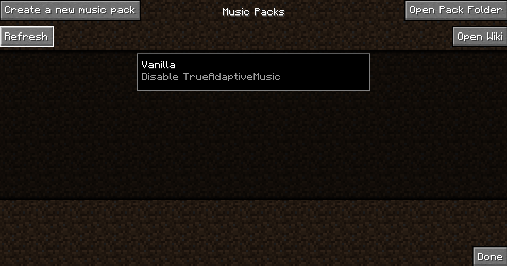

# For Everyone (Start Here)

## Quick Start: For Everyone

First start up Minecraft with the mod loaded and you will now notice a new button at the bottom of the Music & Sound Options menu:

Clicking this will take you to the main menu for True Adaptive Music:

But you don't have any Music Packs yet (probably)! Join the [community discord](https://discord.gg/v64K4hNdXu) to check out the community's creations!

Once you have a pack, head over to [Quick Start: For Users](For%20Users.md). If you are want to make a Music Pack yourself and already have used the mod before, you can skip over to [Quick Start: For Creators](For%20Creators.md).
