# True Adaptive Music Wiki
## Welcome!
Welcome to the wiki for the Minecraft mod True Adaptive Music!
Hit the hamburger for a list of sections, or checkout the quick starts below.
Also, this wiki is very new (in fact non-existent as of me writing this). If you find anything unclear, please let me know on the mod's Curseforge/Modrinth pages, or in the GitHub repo linked at the top right of this wiki.

## Quick Start: For Everyone!
First start up Minecraft with the mod loaded and you will now notice a new button at the bottom of the Music & Sound Options menu:
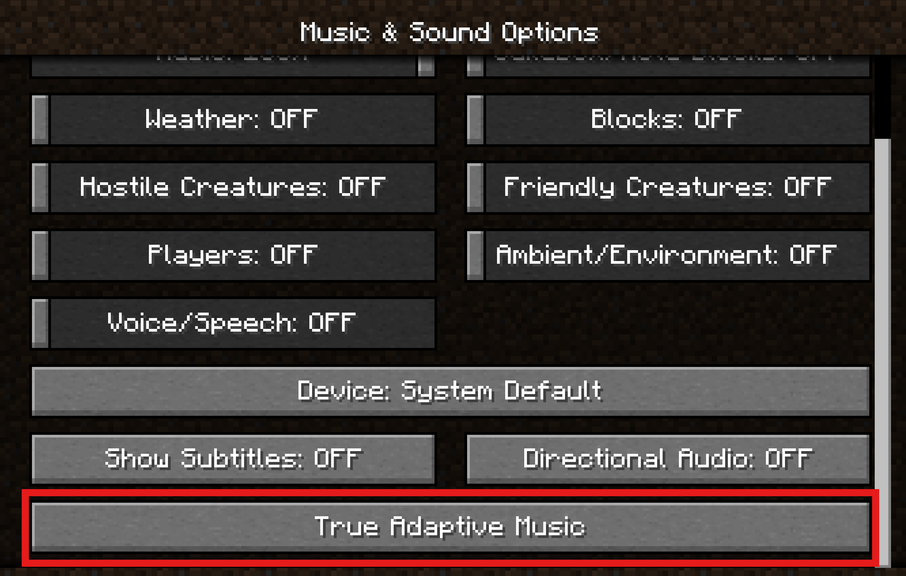

Clicking this will take you to the main menu for True Adaptive Music:
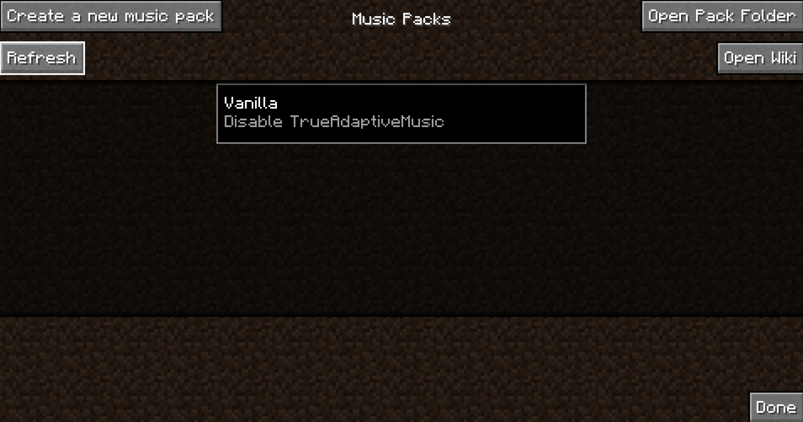

If you want to create a MusicPack, now you can go to [Quick Start: For MusicPack Creators](#quick-start-for-musicpack-creators), but I would still recommend following the way down this page if you are completely new to this mod. Otherwise if you have a MusicPack you just want to use, continue on!

## Quick Start: For MusicPack Users
Hit "Open Pack Folder" to reveal the folder where MusicPacks are stored. This will be the <b>trueadaptivemusicpacks</b> folder, which is generated inside of your Minecraft's installation root (the same folder where you see resourcepacks) the first time you start up Minecraft with the mod.

Throw your .zip or directory file into this folder, then hit "Refresh", and voila! You'll see it show up on this page.

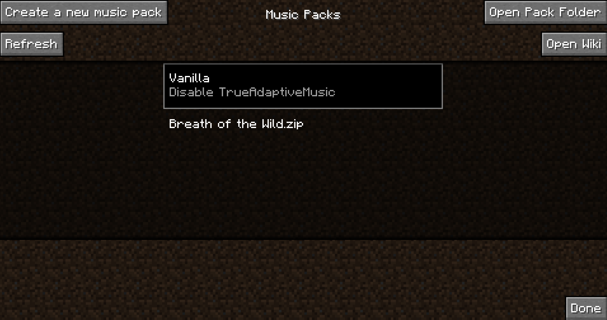

Now just click on your newly loaded pack and (assuming there is custom title screen or root music), you should immediately notice the difference! Have Fun :wink:

## Quick Start: For MusicPack Creators
!!! warning

    MusicPack Creating/Editing is only available for versions 1.20+. All MusicPacks made in any version will still be compatible with other versions.

### Creating new a MusicPack
So you want to create a MusicPack? First of all, thank you! If you have any creations you are proud of by the end of this I encourage you to share! Now, let's get started.

Start by clicking the "Create a new music pack" Button at the top left. This will bring up the MusicPack naming screen. Type in a name and hit "Accept" to continue, which will open the pack editing screen:
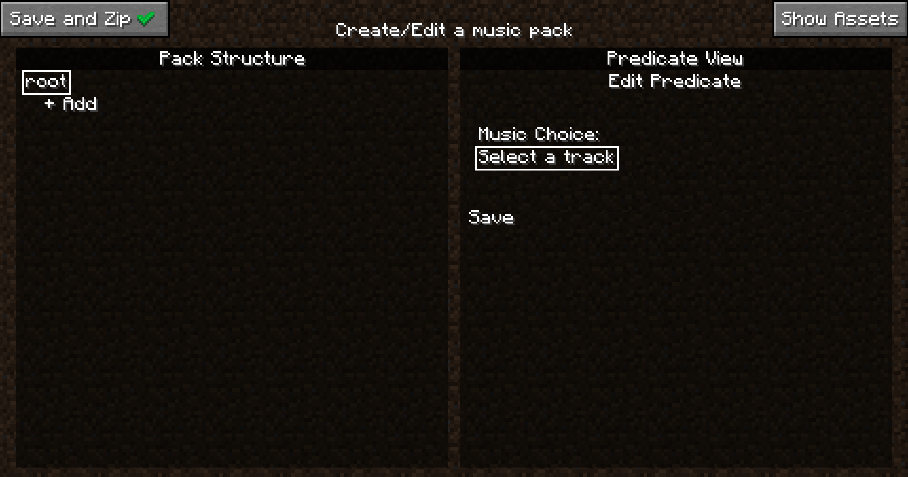

Before we do anything, a quick note on saving. When you opened this editing page, a folder was immediately created called {yourpackname}.new in the trueadaptivemusicpacks folder. From now on, every single action you take will be saved real-time inside this folder, so you don't need to worry about leaving this menu or game crashes. This also offers a great way to incrementally test your pack since you don't need to "Save and Zip" your pack to use it. It will still show up in the main page. Don't believe me? Hit escape to return to the previous page now.
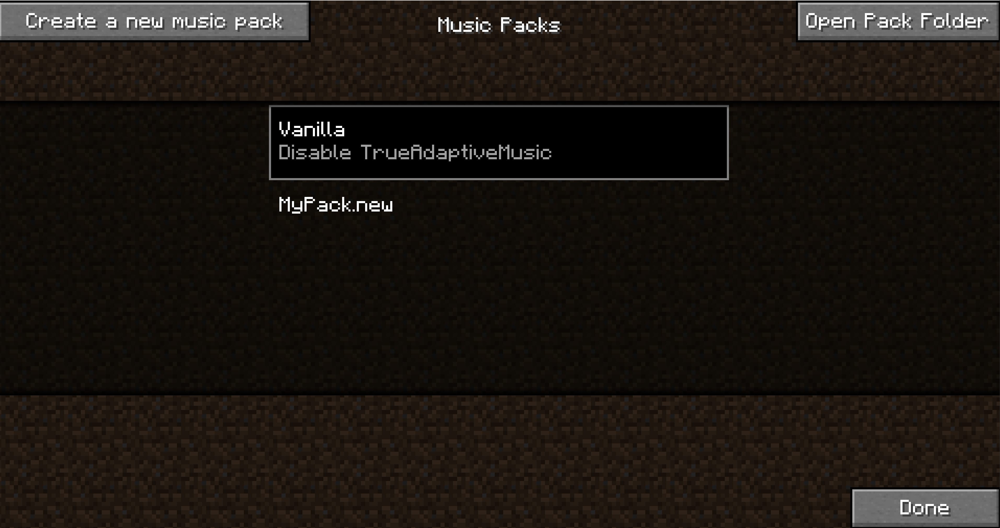

Your new pack should be sitting there all fancy, select it now, and it will auto reload as you exit the pack screen for testing. If you are curious what an empty pack looks like, you can hit the "Open Pack Folder" button to take a look. Otherwise click on your pack if you haven't already, and you will see a "Edit Pack" button show up at the bottom left. Click that to return to the editing screen.

This silence is deafening isn't it, let's go ahead and get some tunes playing. Click on the text labeled "root" at the top left.

Then click the "Select a track" button on the right. To open a dropdown of all available music. If you don't have any mods that add music (and you didn't skip ahead and add your own assets), you should just see a list of all the vanilla Minecraft music expressed as Sound Events. Go ahead and pick one, then hit the "Save" button just under it, we'll be here a while.

Phew! The silence was really getting to me, thanks for that. Now that we have some easy listening, we can talk about the edit screen.

As you can see, the edit screen is seperated into two panels, let's talk about the left first, the Pack Structure panel.

### Pack Structure Panel
The pack structure defines the structural logic of your music pack, specifically when certain music should play. Every music pack has a tree-like structure, with the top level only holding the "root" node in that tree. Every node in this tree represents a predicate. A predicate is just a condition in which certain music can be played, and can be one of many different types. For a list of all types, you can visit the [Predicate Types](MusicPacks/Predicate%20Types.md) page. Every node in the tree has a depth, denoted by how indented the node is on screen, and the "child" node of another node will have 1 more than the depth of its parent. Also within each node is a list of songs to play when that node is chosen (this is what we chose when setting music on the root node).

#### How is a Predicate Node Chosen
Every tick of the game, there is a music manager that traverses this tree and decides what music should be played. It will always pick the music belonging to the maximum depth (most indented) node whose predicate is satisfied, and will prioritize earlier declared node (towards the top of the screen) if there is a tie. If at any point a node is considered not satisfied, all children will automatically not be considered satisfied. This is important as it allows for sectioning off different types of music for different scenarios (we'll dive deeper into this very soon). Another consequence of this is that we must have a root node that is always considered satisfied, as that allows us to define music (or no music) to play when no other predicate nodes are satisfied. This is why you are hearing music right now if you are following this tutorial in order. There are no other predicates to satisfy so it is defaulting to play music defined in the root predicate node. This behavior allows sectioning of music as it allows for something like the following scenario:

##### An Example
Let's say you want to make a very simple music pack that adds combat music to minecraft. You could just add a "combat" node under the root node and put some combat music in that node and you're done... but what if you wanted the music to be different based on what dimension you are in? Instead what you could do is first create some dimension nodes under the root, and then create combat nodes under each dimension node and set the music there. Since only one dimension predicate will be satisfied (you can't be in multiple dimensions at once), it will only play the combat music that you set for that dimension. You could also add some wandering music to each dimension node for some nice atmosphere in between combat.

#### Adding Assets
Now that we know how music is chosen, we can start thinking about how we want to theme the pack. If you want to just try out making a basic pack with vanilla sound events only you can skip down to [Creating the Pack (Finally)](#creating-the-pack-finally). If you are making a pack right now (if you aren't why are you here), you might already have some ideas for how you want to theme your pack. If you do, now would be a good time to gather some assets (external audio files) for your pack. Now I do work for the FBI, CIA, NATO, specifically the Chicago police that patrol O-Block and the Illuminati, so I won't tell you that there are many great ways to get good music from other games to use for your music pack. And I definitely won't tell you that the Internet Archive is a great way to find some. With that in mind, you are going to want to make sure the audio files are up to snuff, as right now this mod only supports .ogg format (blame Notch), though we will certainly be implementing .mp3 support in the near future. Until then, you'll likely need to convert your files to .ogg using some sort of program or website. If you already have a way of doing this, go ahead and skip to [Placing Your Assets](#placing-your-assets). Otherwise continue on!

Since converter websites are sketchy beyond hell as there is nothing stopping them from stuffing any data they want within a file you get there, we'll discuss a much better alternative. Enter the wonderful DAW app Audacity, which you can download [here](https://www.audacityteam.org). Once you have gone through the installation, start it up.

##### Converting with Audacity (the easy way)
There are many ways to batch convert files with Audacity, one of the most cumbersome ways I consistently saw online involved macros (it ain't that deep).
With Audacity open, you'll be met with this window:
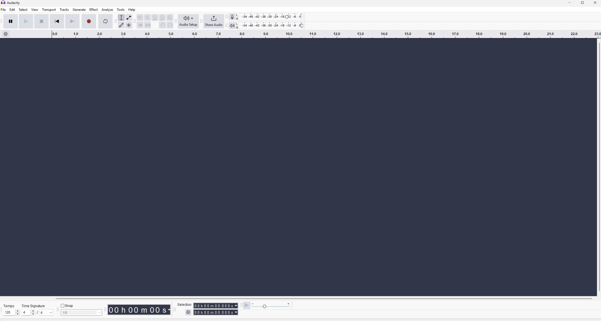

From here, you can simply drag and drop all your files right into the audacity window, and you'll see every file laid out in its own track:
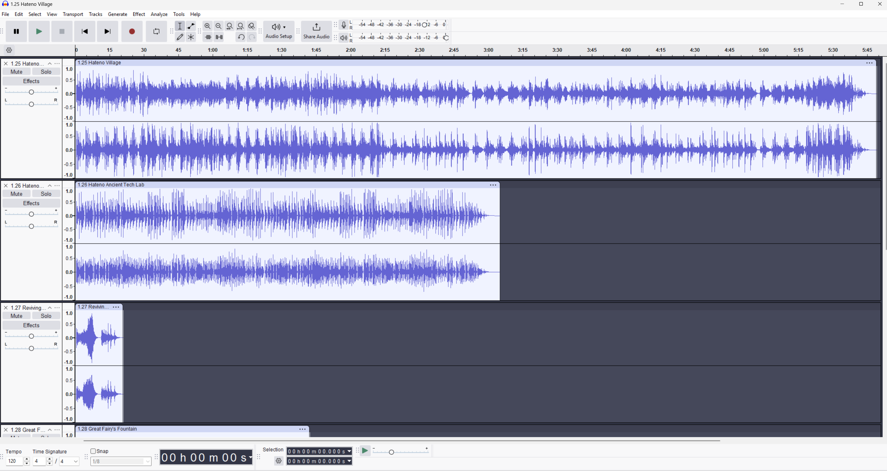

Now it's just a matter of batch exporting these files as .mp3, which you can do by going to File -> Export Audio.
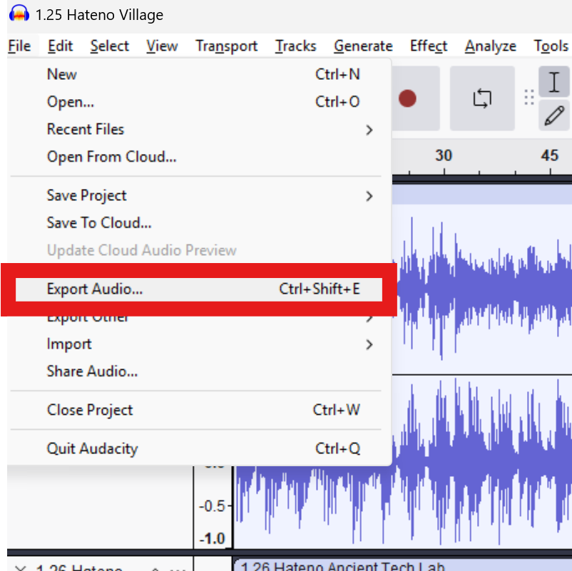

This will open the export window. From here you will want to make sure you have the "Multiple Files" option selected, and also hit the "Browse..." button if you want to save the files to a more convenient place than it already shows.
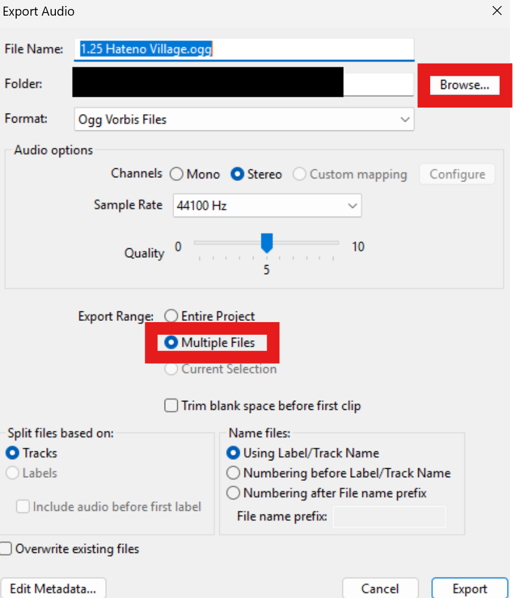

Then hit "Export" and you should see each file get converted in order. Once that is done, go to the destination that was selected and pick up your fresh .mp3 files. You're now ready to move on to placing those files in the right place!

##### Placing Your Assets
This part is easy as pie, just hit the "Open Assets" folder and drag your files into the folder that opens. If that somehow doesn't work, you can just head to the folder yourself, which is in the same directory as the resourcepacks folder in your Minecraft root installation. Find {your_music_pack_name}.new, open it, and drag your files into the assets/ folder.
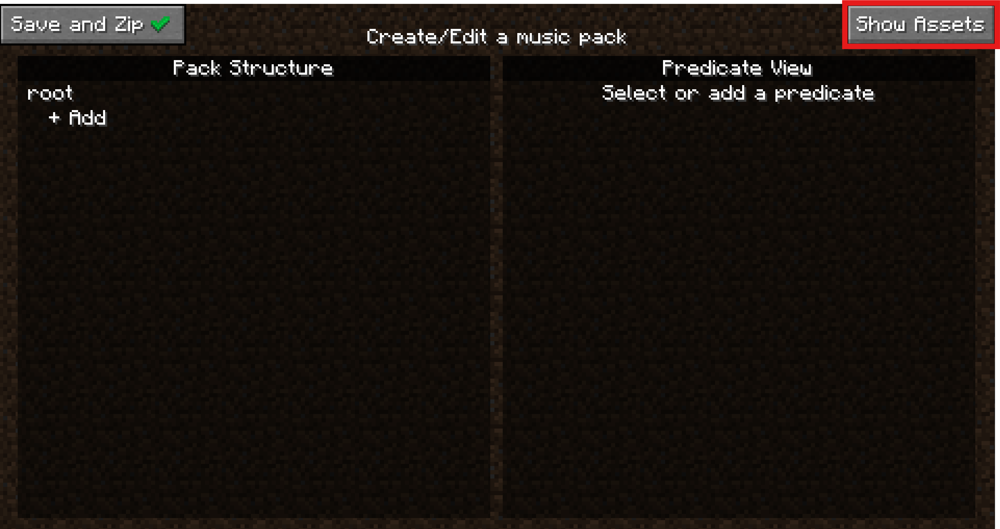

### Creating the Pack (Finally)
Now let's get into actually modifying the structural logic of the pack. You can add a child to any node just by clicking the "+ Add" button under it, which you can do to the button under "root" right now. Once you do, you'll see that the Predicate View panel on the right updated to allow you to create the node. Note that changes made here are not in-effect until the save button at the bottom of the right panel is clicked. For reasons covered in the ["Bruh, why is the save button red"](#bruh-why-is-the-save-button-red) section, we can't create certain predicates from here if you opened this page without being loaded into a world. Pick any that don't have this restriction such as day/night/title_screen. Now you can simply pick a song, or some songs, to play from the "Music Choice" dropdown. If you select a song but want to remove it, just click on it in the list under the dropdown. Once you're done, you can hit "Save" under the Music Choice, and this will commit the change to the actual music pack folder. If you change your mind about any property of a node, you can just click on it and modify any of the same settings (just make sure to hit "Save" again after). You can even go into a world to test this now as long as your ".new" pack is selected from the pack selection screen. As you'll see in this next section, you'll want to join a world in a second anyway ;)
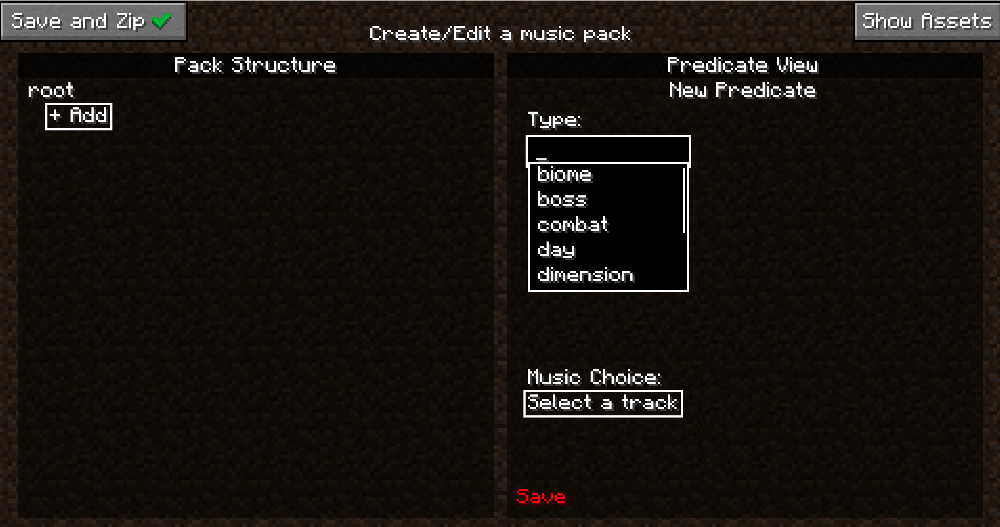

#### "Bruh, why is the save button red"
Slow, down... breathe.... Hover your mouse over the save button and read.... Then probably not understand the gibberish written there because only people who have done Minecraft modding would be able to understand (UI design is my passion). Biomes, dimensions, structures? None of that actually exists until you are loaded into a world in newer Minecraft versions. Because of this, the mod has no idea what biomes, dimensions, etc. exist, so it can't let you choose from them. To rectify this, simply load into the world that has the same mods/datapacks that you are planning on using with the mod. If you do this and add predicates that utilize any non-vanilla objects, be aware that your pack will still work in worlds that don't have them, but the predicates that are associated them will never be satisfied.

#### Other Required Predicate Parameters
With simple predicate types like title_screen, day, or night, the predicate itself is binary (it's either day or it isn't). For other predicate types though, it isn't so simple. Let's examine the dimension predicate for example. First make sure you are loaded into a world, lest you fall victim to the aformentioned red save button. Once you are loaded in, make your way back to the predicate menu and press the "+ Add" button on any node, or click any existing node (other than root) to modify it. Set the predicate type to dimension and you'll see a new "dimension" parameter.
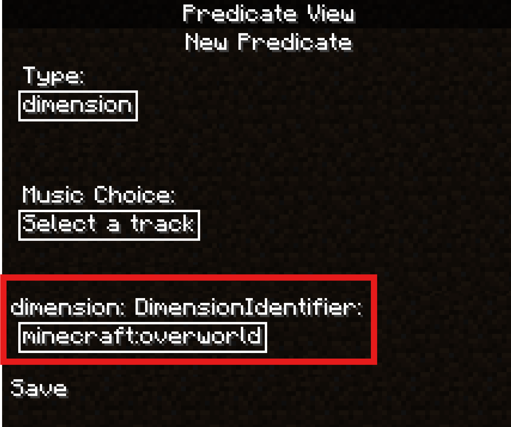

This is another dropdown that allows you to select an identifier for the dimension you want for the predicate. Here you can select any dimension you want, and then select music that can play in that dimension. As said before, you could create child nodes of this dimension node as well to have specific music for day/night/combat/etc.

### Exporting the Pack
That's really all there is to it. You can head to [Other Functionalities](#other-functionalities) for any other features in the editor, but you now know everything you need to make a MusicPack... except... well exporting. Luckily this is super simple, just hit the "Save and Zip" button at the top left:
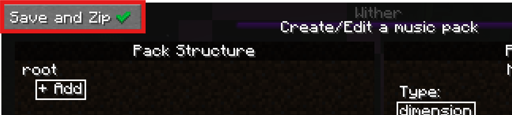

This will delete your ".new" directory and replace it with a zipped up version in the same pack directory so you can send it around easily. Zip files can also be loaded the same way as directories, so you don't need to unzip it to use it. If you decide you want to edit your pack again, just select your ".zip" pack in the pack selection screen and select "Edit Pack" again. This will create another ".new" directory pack and keep your ".zip" as a backup. Selecting "Save and Zip" on the ".new" pack will overwrite your existing ".zip" pack.

### Outro
Congrats on making it through this "quick" start. Once again, please let us know if there is anything you want to see improved with this wiki! You can now continue to the next section for some additional information on the editor, or head to the MusicPacks section at the top left of this wiki for more info on the inner workings of MusicPacks!

### Other Functionalities
Here is a list of some other features you can use in the editor.

#### Moving Predicates
This feature allows you to move predicates that you have already made to other places within the pack structure. For example, you might make some combat music, and then later realize you want to make it only play when in a certain dimension. To move a node (other than "root"), select the node on the Pack Structure side. At the bottom of the Predicate View side of the editor, you will see a "Move" button. Click this button to start moving the node. You can click on any "+ Add" space to move the node there, or any other node itself to make this node the first of its children. You can also click the "Moving" button to cancel. That's it!